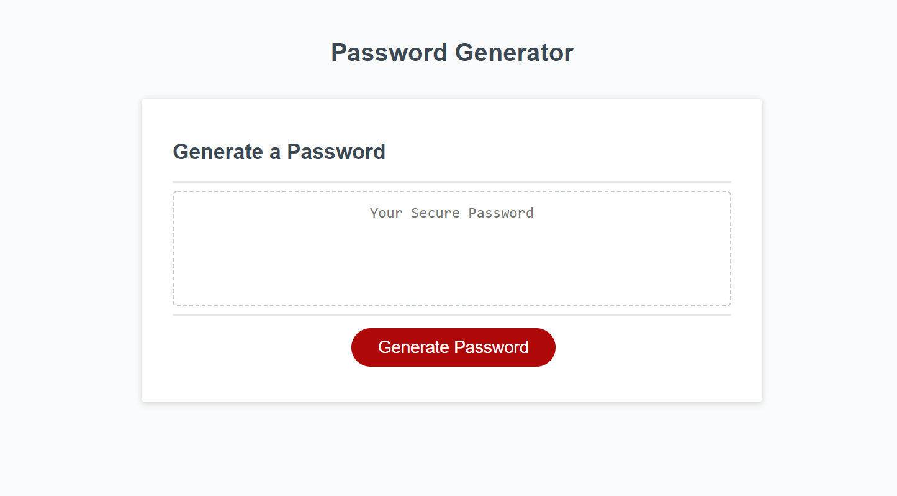

# Friendly-Parakeet

## Purpose
A website that generates random passwords based on input from the user including length and character type specification.

## Built with
* HTML
* CSS
* Javascript

## Website
https://kait-weishaar.github.io/friendly-parakeet/

## Contribution
* HTML, CSS and base Javascript code provided by UW Madison Extension coding bootcamp (Xander Rapstine).
* Javascript functionality by Kait Weishaar
